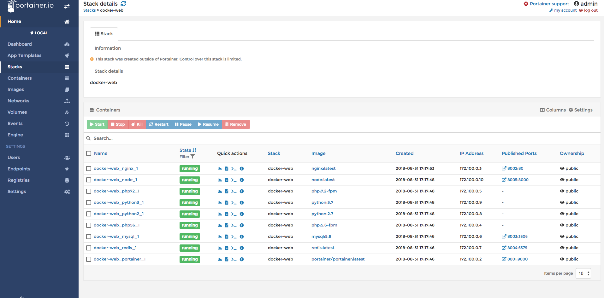
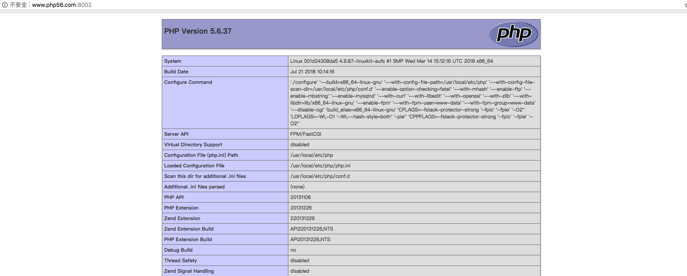
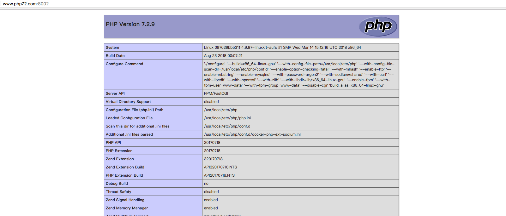
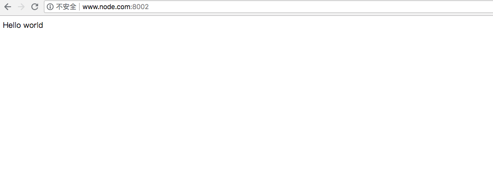

# 使用 Docker 快速搭建 web 开发环境
由于目前我使用的开发环境很多个，每次构建环境都要花很长时间，后面，我了解到 docker 可以快速构建环境，于是我学习了 docker 开发，构建了这个一键环境，后面还会加入更多的东西。
## 为什么要使用docker
- 更高效的利用系统资源
- 更快速的启动时间
- 一致的运行环境
- 持续交付和部署
- 更轻松的迁移
- 更轻松的维护和扩展
## 支持的开发环境
- php5.6
- php7.2
- python2
- python3
- node
## 安装的镜像
- portainer/portainer:latest
- nginx:latest
- php:5.6-fpm
- php:7.2-fpm
- mysql:5.6
- redis:latest
- python:2.7
- python:3.7
- node:latest
## 安装步骤
### 第一步，安装软件
- Git
- Docker
- Docker-compose
### 第二步，获取项目代码

```
$ git clone https://github.com/aimks/docker-web.git
```

### 第三步，运行容器

```
$ cd docker-web
$ docker-compose up -d
```
```
Creating docker-web_portainer_1 ... done
Creating docker-web_mysql_1     ... done
Creating docker-web_redis_1     ... done
Creating docker-web_php72_1     ... done
Creating docker-web_php56_1     ... done
Creating docker-web_python2_1   ... done
Creating docker-web_python3_1   ... done
Creating docker-web_node_1      ... done
Creating docker-web_nginx_1     ... done
```
### 第四步，进入portainer管理项目
- 访问127.0.0.1:8001



### 第五步，配置主机host

```
127.0.0.1           www.php56.com
127.0.0.1           www.php72.com
127.0.0.1           www.node.com
```
### 第六步，访问web地址
- 访问http://www.php56.com:8002/


- 访问http://www.php72.com:8002/


- 访问http://www.node.com:8002/



## Todo
- 使用dockfile
## 常见问题
### 1. 出现Are you trying to mount a directory onto a file (or vice-versa)?

检查docker运行在哪个环境上，如果您在虚拟机中运行Docker，docker 守护程序无权访问您的本地文件，绑定挂载文件是从守护程序运行的主机（也就是虚拟机内）安装的。当尝试./conf/mysql/my.cnf从主机绑定安装配置文件。由于该文件不在虚拟机内，因此守护程序在该位置创建一个空目录，并将其绑定/etc/mysql/my.cnf到容器内部，所以就会出现文件夹绑定到文件的错误了。
我们来确定一下，docker运行在哪个位置。
使用docker info 或者docker-machine ls
```
$ docker info
...
Kernel Version: 4.9.93-boot2docker
Operating System: Boot2Docker 18.06.0-ce (TCL 8.2.1); HEAD : 1f40eb2 - Thu Jul 19 18:48:09 UTC 2018
OSType: linux
...
```
```
$ docker-machine ls
NAME        ACTIVE   DRIVER   STATE     URL                       SWARM   DOCKER        ERRORS
mk-docker   *        xhyve    Running   tcp://192.168.64.2:2376           v18.06.0-ce 
```
上面可以看出我的docker运行在Boot2Docker中，而Boot2Docker是一个名称为mk-docker的xhyve类型的虚拟机，虚拟机的ip为192.168.64.2，这里的主机不是172.0.0.1，而是192.168.64.2。
然后我们再来看看我的另外一台机器。
```
$ docker info
...
Kernel Version: 4.9.87-linuxkit-aufs
Operating System: Docker for Mac
OSType: linux
...
```
```
$ docker-machine ls
NAME        ACTIVE   DRIVER   STATE     URL                       SWARM   DOCKER        ERRORS
```
这台机器没有虚拟机，直接运行在Docker for Mac中，而主机的ip是127.0.0.1，就是当前机器的ip了。
解决办法，在创建虚拟机的时候，要把本机的文件共享到虚拟机中，具体的命令如下。
```
### 最开始我们创建虚拟机的命令
$ docker-machine create -d xhyve --engine-opt dns=114.114.114.114 --engine-registry-mirror https://registry.docker-cn.com --xhyve-memory-size 2048 --xhyve-rawdisk --xhyve-cpu-count 2 mk-docker
### 删除虚拟机
$ docker-machine rm mk-dokcer
### 加上新的参数再次运行
$ docker-machine create -d xhyve --engine-opt dns=114.114.114.114 --engine-registry-mirror https://registry.docker-cn.com --xhyve-memory-size 2048 --xhyve-rawdisk --xhyve-cpu-count 2 --xhyve-experimental-nfs-share mk-docker
```
这里可以看到我们新加了--xhyve-experimental-nfs-share参数，这个参数是共享本机的User到虚拟机中，如果要共享整个目录/，需要将整个参数改为--xhyve-experimental-nfs-share-root。
最后，再次运行docker-compser up ,问题解决。
### 2. mysql运行不起来报错chown: changing ownership of '/var/lib/mysql/': Operation not permitted
因为这个/var/lib/mysql/目录下是使用root建立的，mysql容器对这里目录没有使用权限，mysql容器操作目录时需要使用mysql用户，解决办法就是将mysql容器默认变成mysql用户，将mysql容器加入操作权限user: mysql。
```
mysql:
        image: mysql:5.6
        ports:
            - "${MYSQL_PORT}:3306"
        volumes:
            - ./conf/mysql/my.cnf:/etc/mysql/my.cnf:ro,cached
            - ./mysql/:/var/lib/mysql/:rw,cached
            - ./log/mysql/:/var/log/mysql/:rw,cached
        user: mysql
        environment:
            MYSQL_ROOT_PASSWORD: "${MYSQL_ROOT_PASSWORD}"
        networks:
            web-net:
                ipv4_address: ${MYSQL_IP}
```
我已经把这个命令加入到了项目中，现在不会报这个错误了。

